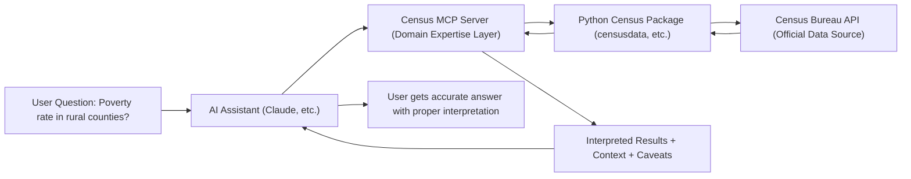

# Census-MCP-Server

> **Disclaimer: This is an independent project and is not officially affiliated with or endorsed by the U.S. Census Bureau. All data is sourced from publicly available Census Bureau APIs.Any opinions or other statements expressed are the authors own and do not necessarily reflect his employer's*

## Census in Your Pocket 📱

Turn any AI assistant into your personal Census data expert. Ask questions in plain English, get accurate demographic data with proper interpretation and context.

**Before:** "I need ACS Table B19013 for FIPS code 24510 with margin of error calculations..."  
**After:** "What's the median income in Baltimore compared to Maryland?"

## The Problem

U.S. Census data is incredibly valuable but practically inaccessible. You need a PhD in Census methodology to navigate the APIs, understand geography codes, interpret margins of error, and avoid common statistical pitfalls. Most people give up and use outdated or incorrect data instead.

## The Solution

Census-MCP-Server creates an expert knowledge layer between AI assistants and Census data. It handles all the complexity while providing natural language access to America's most comprehensive demographic dataset.

**Result:** Anyone can now ask sophisticated demographic questions and get reliable, properly interpreted answers.

## Vision: Democratizing America's Data

**Today:** Census data influences billions in government spending and policy decisions, but only experts can access it effectively.

**Tomorrow:** City council members fact-check claims in real-time during meetings. Journalists get demographic context while writing stories. Nonprofits understand their communities without hiring statisticians. Researchers spend time analyzing instead of wrestling with APIs.

**The Goal:** Make America's most valuable public dataset as easy to use as asking a question.

## How It Works



## Analogies: What This Is Like

**Google Translate for Demographics:** Just as Google Translate lets you communicate in any language without being fluent, Census-MCP-Server lets you access any demographic statistic without being a data scientist.

**Having a Census Expert in Your Pocket:** Like having a demographer sitting next to you who instantly knows which data to pull, how to interpret it properly, and what caveats to mention.

**Stripe for Government Data:** Stripe made payments simple by hiding complexity behind a clean API. We make Census data simple by hiding complexity behind natural language.

**GPS for Data Navigation:** Instead of needing to read maps and calculate routes manually, you just say where you want to go and the system handles the navigation.

## Vision: Democratizing America's Data

**Today:** Census data influences billions in government spending and policy decisions, but only experts can access it effectively.

**Tomorrow:** City council members fact-check claims in real-time during meetings. Journalists get demographic context while writing stories. Nonprofits understand their communities without hiring statisticians. Researchers spend time analyzing instead of wrestling with APIs.

**The Goal:** Make America's most valuable public dataset as easy to use as asking a question.

## Quick Start

*🚧 Work in Progress - Implementation coming soon*

### Prerequisites
- [Claude Desktop](https://claude.ai/download) (or other MCP-compatible AI client)
- Python 3.8+

### Installation

1. Clone this repository:
```bash
git clone https://github.com/yourusername/Census-MCP-Server.git
cd Census-MCP-Server
```

2. Install dependencies:
```bash
pip install -r requirements.txt
```

3. Start the MCP server:
```bash
python mcp_server.py
```

4. Configure your AI client to connect to `localhost:8000`

5. Start asking questions:
   - "What's the poverty rate in Baltimore?"
   - "Which counties in Texas have the highest median income?"
   - "How many seniors live in rural areas of Montana?"

## Example Queries

- **Basic Demographics:** "Population of Miami-Dade County"
- **Comparative Analysis:** "Compare unemployment rates between Detroit and Pittsburgh"
- **Complex Definitions:** "Vulnerable population counts in California counties" 
- **Geographic Patterns:** "Rural poverty rates across the Southeast"
- **Time Series:** "How has median income changed in Austin since 2015?"

## Architecture

The system consists of four main layers:

1. **AI Client Layer:** Claude Desktop, ChatGPT, or other MCP-compatible assistants
2. **MCP Server (This Project):** Domain expertise, query translation, result interpretation
3. **Census Package Layer:** Python libraries like `censusdata` that handle API communication
4. **Data Source Layer:** Official U.S. Census Bureau APIs

Each layer handles its specialized function, creating a robust and maintainable system.

## What Makes This Different

**Domain Expertise Encoding:** Knows which data combinations work, how to interpret margins of error, what geographic comparisons are valid.

**Natural Language Interface:** Ask questions like a human, not like a programmer.

**Proper Statistical Context:** Automatically includes caveats, confidence intervals, and methodology notes.

**Error Prevention:** Prevents common mistakes like comparing incompatible geographies or misinterpreting survey estimates.

## Technical Details

- **Built on:** Model Context Protocol (MCP)
- **Dependencies:** Python census packages (censusdata, etc.)
- **Data Source:** Official U.S. Census Bureau APIs
- **Compatibility:** Works with any MCP-compatible AI assistant

## Contributing

This project aims to democratize access to public data. Contributions welcome:

- Domain expertise improvements
- Additional data sources
- Better error handling  
- Documentation enhancements
- New AI client integrations

## Roadmap

- [ ] **Phase 1:** American Community Survey (ACS) support
- [ ] **Phase 2:** Additional Census surveys (SIPP, Economic Census)
- [ ] **Phase 3:** Geographic visualization capabilities
- [ ] **Phase 4:** Multi-agency data integration (BLS, BEA, etc.)
- [ ] **Phase 5:** Real-time policy impact analysis

## License

MIT License - See LICENSE file for details

## Acknowledgments

Built on the excellent work of:
- [censusdata](https://pypi.org/project/censusdata/) Python package
- [tidycensus](https://walker-data.com/tidycensus/) R package (inspiration)
- The dedicated teams at the U.S. Census Bureau who collect and maintain this vital public data

---

```
CORBA ORB                    RDF
    ↓                         ↓
  SOAP                      OWL
    ↓                         ↓
  REST                    SPARQL
    ↓                         ↓
GraphQL               Knowledge Graphs
    ↓                         ↓
   MCP ←——————————————————→ LLMs
```

*"The patterns never really die, they just get better UX"*
