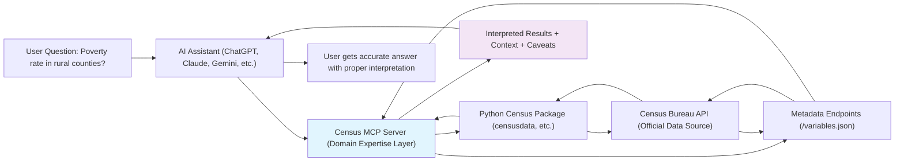

# Census-MCP-Server

> **Disclaimer: This is an independent project and is not officially affiliated with or endorsed by the U.S. Census Bureau. All data is sourced from publicly available Census Bureau APIs with endpoint versions pinned to current releases. No Census seals, logos, or branding are used in compliance with Title 13 restrictions. Any views expressed are those of the authors and not those of the U.S. Census Bureau.**

## Census in Your Pocket 📱

*Work in Progress - Building an AI interface for Census data*

Turn any AI assistant into your personal Census data expert. Ask questions in plain English, get accurate demographic data with proper interpretation and context.

**Before:** "I need ACS Table B19013 for FIPS code 24510 with margin of error calculations..."  
**After:** "What's the median income in Baltimore compared to Maryland?"

## The Problem

U.S. Census data is incredibly valuable but has a steep learning curve for non-specialists. Even experienced researchers struggle with geographic hierarchies, variable naming conventions, margin of error calculations, and knowing which data combinations actually work. In our experience, the biggest impediment to demographic analysis is often just figuring out how to get the right data in the first place.

## Vision: Democratizing America's Data

**Today:** Census data influences billions in government spending and policy decisions, but accessing it effectively requires specialized knowledge that creates barriers for many potential users.

**Tomorrow:** City council members fact-check claims in real-time during meetings. Journalists get demographic context while writing stories. Nonprofits understand their communities without hiring statisticians. Researchers spend time analyzing instead of wrestling with APIs.

**The Goal:** Make America's most valuable public dataset as easy to use as asking a question.

## How It Works



*Note: Complex queries may require multiple API calls and batch orchestration*

## Analogies: What This Is Like

**GPS for Data Navigation:** Instead of needing to read maps and calculate routes manually, you just say where you want to go and the system handles the navigation.

**Having a Census Expert in Your Pocket:** Like having a demographer sitting next to you who instantly knows which data to pull, how to interpret it properly, and what caveats to mention.

**What Stripe Did for Payments:** Stripe made online payments simple by hiding complexity behind a clean interface. We aim to make Census data simple by hiding complexity behind natural language.

## Current Scope: Starting with ACS

**Phase 1 Focus:** American Community Survey (ACS) 5-year estimates
- Most flexible annual demographic dataset
- Well-supported by existing Python packages
- Covers demographics, economics, housing, social characteristics
- *Note: 5-year estimates include every census tract and county; 1-year estimates do not*

**Future Expansion:** Additional surveys (SIPP, Economic Census), geographic visualizations, multi-agency integration

## What We're Building

**Smart Query Translation:** Convert natural language questions into proper Census API calls, handling geography codes (including ambiguous place name resolution like "Springfield, IL" vs FIPS codes), variable selection (mapping B19013_001E → "Median household income"), and valid combinations.

**Domain Knowledge Integration:** Encode expertise about which data sources are appropriate for different questions, when estimates are reliable, and how to interpret results correctly.

**Statistical Context:** Automatically include margins of error with proper propagation for both ratios and sums, suppression flags for unreliable estimates (CV ≥ 15% or estimate ≤ 50), and methodology notes where relevant.

**Error Prevention:** Guide users away from common mistakes like inappropriate geographic comparisons or mismatched time periods.

## Example Use Cases

- **Basic Demographics:** "Population of Miami-Dade County"
- **Comparative Analysis:** "Compare unemployment rates between Detroit and Pittsburgh" *(derived from B23025 variables)*
- **Geographic Patterns:** "Rural poverty rates across the Southeast"
- **Time Series:** "How has median income changed in Austin since 2015?"

*Note: Complex definitions like "vulnerable populations" will be clearly specified using established indices (e.g., CDC Social Vulnerability Index).*

## Architecture

The system consists of five main layers:

1. **AI Client Layer:** MCP-compatible assistants
2. **MCP Server (This Project):** Domain expertise, query translation, result interpretation
3. **Cache/Store Layer:** SQLite/DuckDB for repeated query optimization
4. **Census Package Layer:** Python libraries like `censusdata` that handle API communication  
5. **Data Source Layer:** Official U.S. Census Bureau APIs

Each layer handles its specialized function, creating a maintainable system that can evolve as both AI tools and Census data infrastructure change.

## Technical Approach

**Built on:** Model Context Protocol (MCP) - *Note: MCP is experimental and subject to breaking changes*

**Dependencies:** Python census packages (`censusdata` for ACS/decennial data, custom implementations for other surveys as needed)

**Python Version:** 3.9-3.12 (tested range)

**Rate Limiting:** Implements caching and throttling strategies to respect Census API limits (500 req/min global, 100K/day per user)

**Data Integrity:** Returns only published aggregates with proper threshold flags (DP_NOTES) for unreliable tabulated data, never record-level data

## Quick Start

*🚧 Implementation in Progress*

### Prerequisites
- MCP-compatible AI client (reference implementations: lm-studio, ollama)
- Python 3.9-3.12

### Future Installation
```bash
git clone https://github.com/yourusername/Census-MCP-Server.git
cd Census-MCP-Server
pip install -r requirements.txt
python mcp_server.py
```

## Contributing

This project aims to democratize access to public data. We welcome contributions in:

- Domain expertise improvements (especially from Census data veterans)
- Statistical methodology implementation
- Additional data source integration
- Documentation and examples
- Testing with real-world use cases

## Roadmap

- [ ] **Phase 1:** ACS 5-year estimates with basic query translation
- [ ] **Phase 2:** Statistical rigor (MOE propagation, apply ACS CV ≥ 15% or estimate ≤ 50 as unreliable by default)
- [ ] **Phase 3:** Additional Census surveys (SIPP, Economic Census, PEP)
- [ ] **Phase 4:** Geographic visualization capabilities
- [ ] **Phase 5:** Multi-agency data integration (BLS uses CBSA codes, BEA uses BEA regions - non-trivial crosswalks required)

## Acknowledgments

Built on the excellent work of:
- [censusdata](https://pypi.org/project/censusdata/) Python package
- [tidycensus](https://walker-data.com/tidycensus/) R package (inspiration)
- The dedicated teams at the U.S. Census Bureau who collect and maintain this vital public data

---

```
     RPC        DCE            RDF
      ↓          ↓              ↓ 
   CORBA       DCOM           OWL
      ↓          ↓              ↓
      └─→ SOAP ←┘            SPARQL
           ↓                   ↓
         REST           Knowledge Graphs
           ↓                   ↓
        GraphQL                ↓
           ↓                   ↓
          MCP ←─────────────→ LLMs
```

*"The patterns never really die, they just get better UX"*
