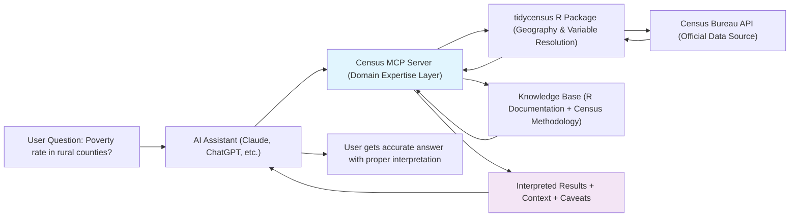

# Census-MCP-Server

> **Disclaimer: This is an independent project and is not officially affiliated with or endorsed by the U.S. Census Bureau. All data is sourced from publicly available Census Bureau APIs with endpoint versions pinned to current releases. No Census seals, logos, or branding are used in compliance with Census graphic standards. Any views expressed are those of the authors and not those of the U.S. Census Bureau.**

## Census in Your Pocket 📱

Turn any AI assistant into your personal Census data expert. Ask questions in plain English, get accurate demographic data with proper interpretation and context.

**Before:** "I need ACS Table B19013 for FIPS code 24510 with margin of error calculations..."  
**After:** "What's the median income in Baltimore compared to Maryland?"

## 🚀 Quick Start - Ready to Use!

### Option 1: Pre-built Container (Recommended)
```bash
# Run the Census MCP server (one command - everything included!)
docker run -e CENSUS_API_KEY=your_key ghcr.io/brockwebb/census-mcp-server:latest

# Or without API key (still works, just slower rate limits)
docker run ghcr.io/brockwebb/census-mcp-server:latest
```

### Claude Desktop Configuration
Add to your `claude_desktop_config.json`:

**macOS:** `~/Library/Application Support/Claude/claude_desktop_config.json`  
**Windows:** `%APPDATA%\Claude\claude_desktop_config.json`

```json
{
  "mcpServers": {
    "census-mcp": {
      "command": "docker",
      "args": ["run", "--rm", "-i", "-e", "CENSUS_API_KEY=your_census_key", "ghcr.io/brockwebb/census-mcp-server:latest"]
    }
  }
}
```

**That's it!** Restart Claude Desktop and you'll see a 🔨 hammer icon indicating the Census tools are available.

### Get a Census API Key (Optional but Recommended)
1. Visit: https://api.census.gov/data/key_signup.html
2. Register for a free API key (improves rate limits)
3. Add to your Docker command or Claude Desktop config

### Try It Out
Ask Claude questions like:
- "What's the population of Austin, Texas?"
- "Compare median income between California and Texas"  
- "What's the poverty rate in rural counties?"
- "How do teacher salaries vary by state?" (it will correctly guide you to BLS data!)

## The Problem

U.S. Census data is incredibly valuable but has a steep learning curve for non-specialists. Even experienced researchers struggle with geographic hierarchies, variable naming conventions, margin of error calculations, and knowing which data combinations actually work. In our experience, the biggest impediment to demographic analysis is often just figuring out how to get the right data in the first place.

## Vision: Democratizing America's Data

**Today:** Census data influences billions in government spending and policy decisions, but accessing it effectively requires specialized knowledge that creates barriers for many potential users.

**Tomorrow:** City council members fact-check claims in real-time during meetings. Journalists get demographic context while writing stories. Nonprofits understand their communities without hiring statisticians. Researchers spend time analyzing instead of wrestling with APIs.

**The Goal:** Make America's most valuable public dataset as easy to use as asking a question.

## How It Works



## What's Included in the Container

**🏗️ Complete Self-Contained System:**
- R environment with tidycensus, dplyr, and geospatial libraries
- Python environment with MCP server and vector database  
- Pre-built knowledge base (85MB) with Census methodology and R documentation
- All dependencies and configurations ready to go

**📚 Built-in Intelligence:**
- **Semantic Query Layer:** Natural language → statistical concepts ("teacher salaries" → BLS guidance, "poverty" → proper Census variables)
- **145+ pre-mapped demographic variables** with fuzzy matching and concept expansion
- **Vector database with expert knowledge** from Census methodology, R documentation, and statistical best practices
- **Smart geography parsing** (handles "Austin, TX" → proper geographic codes, major city disambiguation)
- **Statistical guidance** (when to use medians vs means, margin of error interpretation, survey limitations)
- **Power Law optimization:** Core variables (<100ms) + comprehensive tidycensus fallback

**🔄 No Setup Required:**
- No R installation needed
- No Python environment configuration  
- No knowledge base building
- No API wrestling

## Example Use Cases

- **Basic Demographics:** "Population of Miami-Dade County"
- **Comparative Analysis:** "Compare unemployment rates between Detroit and Pittsburgh"
- **Housing Statistics:** "How many renter-occupied units in Phoenix?"
- **Geographic Patterns:** "Rural poverty rates across the Southeast"
- **Smart Routing:** Ask about teacher salaries → guides you to BLS data instead of conflated Census categories

## Architecture

The system consists of five main layers:

1. **AI Client Layer:** Claude Desktop, Cursor, or other MCP-compatible assistants
2. **MCP Server (This Project):** Domain expertise, query translation, result interpretation
3. **Knowledge Base:** Vector database with R documentation and Census methodology  
4. **Data Retrieval:** tidycensus R package handling API communication and geography resolution
5. **Data Source Layer:** Official U.S. Census Bureau APIs

Each layer handles its specialized function, creating a maintainable system that can evolve as both AI tools and Census data infrastructure change.

## Current Scope: American Community Survey Focus

**What Works Now:**
- American Community Survey (ACS) 5-year estimates
- Demographics, economics, housing, social characteristics
- Geographic resolution from national to place level
- Proper statistical interpretation with margins of error

**Future Expansion:** Additional surveys, geographic visualizations, multi-agency integration

## Technical Details

**Built on:** Model Context Protocol (MCP) for AI tool integration  
**Core Engine:** tidycensus R package by Kyle Walker  
**Knowledge Base:** ChromaDB vector database with sentence transformers  
**Container:** ~4GB Docker image with all dependencies  
**Rate Limiting:** Built-in throttling and caching strategies  

## Development Setup (Advanced Users)

If you want to modify or extend the system:

```bash
git clone https://github.com/brockwebb/census-mcp-server.git
cd census-mcp-server

# Build from source (requires R, Python, and substantial setup)
./build.sh

# Or use the pre-built container and modify as needed
docker run -v $(pwd):/workspace ghcr.io/brockwebb/census-mcp-server:latest
```

## Acknowledgments

This project builds on exceptional work by:

- **[Kyle Walker](https://github.com/walkerke)** and the [tidycensus](https://walker-data.com/tidycensus/) R package - the gold standard for Census data access that handles the complex geography and API intricacies we rely on
- **[Anthropic](https://www.anthropic.com/)** for the Model Context Protocol enabling seamless AI tool integration
- **The dedicated teams at the U.S. Census Bureau** who collect and maintain this vital public data
- **The MCP community** for building the ecosystem that makes this integration possible

Special thanks to Kyle Walker whose tidycensus documentation and methodology formed the foundation of our knowledge base. This project essentially wraps tidycensus with natural language intelligence - all the hard statistical and geographic work was solved by the tidycensus team.

## Contributing

This project aims to democratize access to public data. We welcome contributions in:

- Domain expertise improvements (especially from Census data veterans)
- Additional geographic resolution and disambiguation
- Statistical methodology implementation  
- Additional data source integration
- Documentation and examples
- Testing with real-world use cases

## Roadmap

- [x] **Phase 1:** ACS 5-year estimates with natural language query translation
- [x] **Phase 2:** Containerized deployment with pre-built knowledge base  
- [x] **Phase 2.5:** Semantic intelligence layer - variable concept mapping, statistical routing, RAG-enhanced responses
- [ ] **Phase 3:** Performance optimization - semantic index for <100ms common queries, enhanced geographic disambiguation
- [ ] **Phase 4:** Additional Census surveys (Economic Census, SIPP, PEP)
- [ ] **Phase 5:** Multi-agency data integration (BLS employment, BEA economic data)

---

<pre>
     RPC        DCE            RDF
      ↓          ↓              ↓ 
   CORBA       DCOM           OWL
      ↓          ↓              ↓
      └─→ SOAP ←┘            SPARQL
           ↓                   ↓
         REST           Knowledge Graphs
           ↓                   ↓
        GraphQL                ↓
           ↓                   ↓
          MCP ←─────────────→ LLMs
</pre>

*"The patterns never really die, they just get better UX"*
