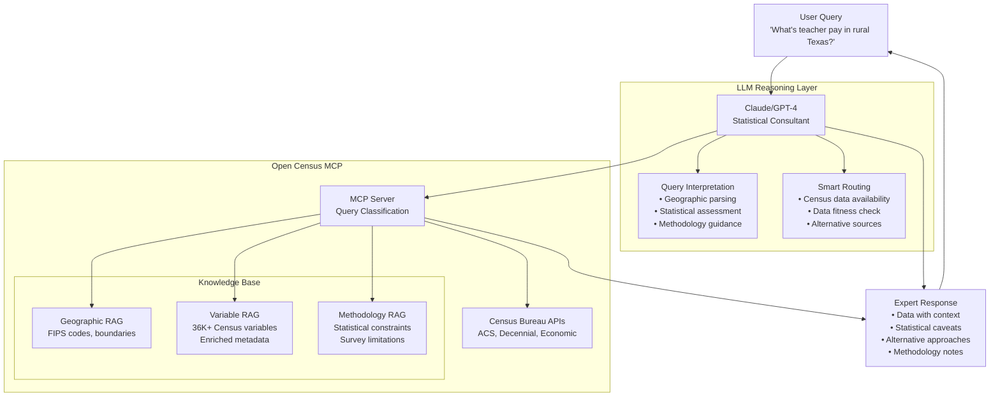

# Open Census MCP: Lessons Learned

> **Disclaimer: This is an independent project and is not officially affiliated with or endorsed by the U.S. Census Bureau. All data is sourced from publicly available Census Bureau APIs with endpoint versions pinned to current releases. No Census seals, logos, or branding are used in compliance with Census graphic standards. Any views expressed are those of the authors and not those of the U.S. Census Bureau.**

## TL;DR

Built an AI statistical consultant for Census data that transforms "I need ACS Table B19013 for FIPS code 24510" into "What's the median income in Baltimore?" **Key lesson: Let LLMs do 90% of the work** - they excel at geographic parsing, variable selection, and statistical reasoning. Save the fancy RAG/vector search for the last 10%. 

**Architecture insight:** The LLM reasoning layer is first, followed by specialized MCP knowledge bases for validation. **Reality check:** Any 8th grader should be able to access authoritative demographic data with proper context and limitations. **Technical battle:** Fought sentence transformers, configuration complexity, and the "personality problem" across sessions. **Bottom line:** We're building consultative AI that augments expert judgment, not automated lookup that bypasses human expertise.

## Overview

This document covers the key lessons learned from building the Open Census MCP, an AI-powered statistical consultant for U.S. Census data. The project demonstrates how to combine LLM reasoning with specialized knowledge bases to democratize access to authoritative demographic information.

### What We Built

- LLM-first architecture for Census data consultation
- Natural language interface to 36K+ Census variables
- Geographic resolution using AI interpretation
- Statistical methodology guidance system
- Docker containerized MCP server

### Key Insights Covered

- The 90/10 rule for LLM vs specialized tools
- Technical tradeoffs in vector embeddings
- Configuration management lessons
- Error handling in distributed AI systems
- Cross-survey architecture potential

## Value Proposition: Why We Need This

### The Problem
Census data is a treasure trove of information about our people and economy, but accessing it effectively requires specialized knowledge that creates barriers for most potential users. The current state:

- **API complexity**: Even experienced developers struggle with geographic hierarchies, variable naming conventions, and margin of error calculations
- **Expertise barrier**: Few people have the statistical methodology knowledge needed to make Census data useful and valid
- **User experience gap**: Figuring out how to get the right data is often the biggest impediment to demographic analysis
- **Fitness assessment**: Understanding data limitations and whether data are appropriate for your purpose requires deep expertise

### The Vision
**Any 8th grader with an active imagination should be able to pull all kinds of authoritative data and get simple language explanations about it.**

We're not building another API wrapper. We're delivering a **statistical consultant** who can understand what you're asking and provide you with helpful data, along with proper context, limitations, and guidance on methodology.

**Before:** "I need ACS Table B19013 for FIPS code 24510 with margin of error calculations..."  
**After:** "What's the median income in Baltimore compared to Maryland?"

### Democratizing America's Data
Census data influences billions in government spending and policy decisions. Making it accessible means:
- City council members fact-checking claims in real-time during meetings
- Journalists getting demographic context while writing stories  
- Researchers focusing on analysis instead of data wrangling
- Citizens understanding their communities through authoritative data

## Architecture: LLM-First Design

### Key Architectural Insight
**The LLM provides the reasoning layer FIRST, then uses the MCP.** The MCP contains specialized knowledge (geography, variables, methodology) but the LLM orchestrates the entire consultation process.

## Core Lesson: Let the LLM Do the Heavy Lifting

### The 90/10 Rule
**LLMs get you 90% of the way with 10% of the effort.** These are highly sophisticated tools that you'll never match with 2010-era pattern matching, regex, or traditional NLP techniques.

All the fancy tricks - RAG, semantic search, vector databases - are there to close the last mile. But to get that remaining 10% takes 90% of your effort, and you'll never achieve "perfect" accuracy anyway.

### The Last Mile Problem
Moving power or internet to a neighborhood is easy - it's a straight line. But wiring up each house in that neighborhood requires running 20+ miles of cable for local connections. It's that local complexity and nuance where the real effort lies.

**LLMs can handle most of that last mile too**, but there will always be a shared burden requiring human oversight and guidance.

### Practical Examples
- **Geographic Resolution**: LLM understands "San Francisco, CA" → FIPS 06:67000 (95%+ accuracy)
- **Variable Selection**: LLM maps "poverty rate" → appropriate Census tables and calculations
- **Statistical Consultation**: LLM knows when to route teacher salary questions to BLS instead of Census

## Technical Lessons Learned

### 1. Start Simple, Add Complexity Gradually
**Keep MCPs focused.** Trying to make an MCP do too many things creates:
- Bloat and performance issues
- Harder troubleshooting 
- Black box behavior
- Quality degradation

Just like in prompting, specificity and separation of concerns improves output quality.

### 2. Configuration Management is Critical
Technical challenges encountered:

**Vector Embeddings**: Tried sentence transformers to avoid OpenAI API costs, but:
- Aging models (most from 2022, pre-ChatGPT era)
- Limited dimensions compared to OpenAI (384 vs 1536-3072)
- Stability and development issues
- Configuration complexity managing multiple embedding systems

**Loading Time**: Lazy loading created inconsistent behavior and timeout errors:
- Large sentence transformer models caused startup failures
- Switched to eager initialization for predictable performance
- Bloat removal became critical for reliable operation

### 3. Error Handling in Distributed Systems
**Debugging MCPs is harder than traditional applications.** Best practices:
- Start MCP server in command shell to see errors directly
- Logs are harder to trace than real-time error output
- Error isolation prevents cascade failures across components
- Design for graceful degradation when components fail

### 4. The Personality Problem
**Model behavior varies between sessions.** Without system-level prompts:
- You can dial in behavior during a thread/session
- New threads reset to approximate baseline behavior
- Agents provide more precision with focused instructions
- Limited scope helps maintain consistency

## MCP as Technology Platform

### Current State: Early Experimentation
MCPs feel like GenAI images in early 2022:
- High technical barrier to setup and innovation
- Lots of manual configuration required
- Rapid experimentation and change
- Limited options, mostly local environments

### Future Vision: Encapsulated Agent Framework
**MCPs will make sense at the host/provider level** for making functions discoverable and useful. Currently, building everything locally is like early agent development.

### Refactoring Considerations
The Open Census MCP could easily refactor as an agent workflow:
- Process is broken down into discrete, deterministic steps
- Easier to troubleshoot with separated components  
- QC agents could supervise and ensure accuracy
- More flexibility for adding value without MCP bloat

**Cross-Survey Architecture Potential**: Geographic intelligence is universal across federal surveys - FIPS codes and location parsing work for CPS, SIPP, ACS, etc. But each survey needs specialized knowledge bases for variables and methodology. The refactored architecture could share a Geographic Agent while maintaining survey-specific agents (CPS Knowledge Agent and ACS Knowledge Agent), as well as a Cross-Survey Mapping Agent for concept bridging. This would mostly resolve personality consistency issues through focused agent instructions, while enabling queries like "unemployment data" to intelligently route between ACS occupation information and CPS labor force statistics.

### Data Enrichment Strategy
**Simple keyword and description expansion was a smart move** for broadening concept linkage and understanding. Probably didn't need as much enrichment as was implemented, but the approach significantly improved discoverability.

## Design Decisions and Tradeoffs

### 1. Semantic Search Limitations
**Overbuilt the RAG systems initially:**
- Too much methodology content caused "semantic smearing"
- Had to prune down to avoid concept contamination
- Variable search suffered from similar over-enrichment
- Solution: Extract simple concepts and keywords, add metadata after discovery

### 2. LLM-First Architecture Challenges
**Getting the LLM to be 'first' in the reasoning layer was a constant battle. ** This is what leads to potentially using separate agents or MCPs in a workflow approach, rather than trying to embed everything in one system. **

### 3. The Authority Bias Problem
**People tend to believe machine outputs without critical evaluation.** But humans are wrong all the time and have their own "hallucinations" in data interpretation.

Using AI tools doesn't free us from the responsibility of reviewing outputs and applying critical thinking and human judgment. Information, communication, and assimilation always leave room for distortion.

## Key Observations

### Execution vs Planning
**With AI tools, execution of processes becomes cheaper.** This makes upfront planning and work design all the more critical. The bottleneck shifts from doing the work to defining the work correctly.

### Quality Control Reality
**You'll never achieve perfect accuracy and precision.** The goal is acceptable loss levels while maintaining utility. Focus on:
- Clear limitation documentation
- Alternative approach suggestions  
- Transparent methodology explanations
- Human oversight integration points

### Real-World Testing Reveals Assumptions
**The teacher salary analysis case study** revealed multiple system failures:
- Geographic resolution broke on standard "City, State" format
- Multi-location queries had 100% failure rate
- Statistical consultation crashed with type errors
- Over-reliance on tools instead of using known good data

The system should have immediately recognized that:
- ACS doesn't track teacher salaries by district
- School districts don't align with Census boundaries
- Small rural samples create unreliable estimates
- Administrative data (Texas Education Agency) is the superior source

## Recommendations for MCP Development

### 1. Architecture Principles
- **LLM-first reasoning** with specialized knowledge bases for validation
- **Start with core domain knowledge** already in LLM training
- **Use RAG for current specifications**, not basic concepts  
- **Implement complexity classification** to route simple vs complex queries
- **Design for graceful failure** with alternative suggestions

### 2. Development Strategy
- **Proof of concept first** before large system builds
- **Modular architecture** enabling component replacement
- **Leverage existing ecosystems** (like tidycensus for Census data)
- **Focus on user experience** over technical sophistication
- **Plan for cross-system integration** from the start

### 3. Quality Assurance
- **Encode domain constraints** in system architecture
- **Require methodology transparency** in all responses
- **Test with real user workflows**, not synthetic queries
- **Plan for human oversight** in complex analysis
- **Document limitations prominently** rather than hiding them

## Next Steps and Broader Implications

### Technical Evolution
The Open Census MCP demonstrates that **consultative AI is achievable** for specialized domains. Key principles:

1. **Domain expertise must be encoded in system architecture**, not just training
2. **Statistical literacy is a system requirement**, not user responsibility  
3. **Complex analysis requires user consent** and methodology transparency
4. **LLMs excel at orchestration and interpretation**, not just generation

### Platform Potential
This approach could extend to:
- **Cross-agency data integration** (Census + BLS + BEA + NCHS)
- **Multi-modal interfaces** (voice queries, visualization generation)
- **Advanced analytical workflows** with automated planning steps
- **Community-driven enhancements** leveraging open source ecosystems

### Policy and Access Implications
There is high potential for improving access and the ability to gather and develop evidence based on data that is fit for use and purpose. Success comes through improved communication using simple language and concepts that are more relatable to the audience, while maintaining statistical rigor and methodological transparency.
---

*This project represents a paradigm shift from data lookup to statistical consultation, demonstrating that AI can democratize access to authoritative information while maintaining methodological integrity.*
