````markdown
# Open Census MCP – Core Architecture & Pipelines

---

## 1 — End-to-end System Architecture

```mermaid
graph TB
    subgraph User_Layer
        U[How much do teachers make in Austin?]
        CD[Claude Desktop]
        U --> CD
    end

    subgraph MCP_Protocol_Layer
        CD --> MCP[MCP Server Entry Point]
    end

    subgraph Intelligence_Layer
        MCP --> QP[Query Parser & Router]
        QP --> SI[Semantic Index\n⚡ <100 ms Core Queries]
        QP --> KB[Knowledge Base\n📚 RAG Vector Search]

        SI --> SM[Static Mappings\n🎯 Power-Law Variables]
        SI --> FC[Fuzzy Matcher\n🔍 Alias Expansion]

        KB --> VDB[Vector DB\nChroma + ST]
        KB --> DOC[R Docs\nCensus Methodology]
    end

    subgraph Data_Retrieval_Layer
        SM --> RE[R Engine\ntidycensus]
        FC --> RE
        KB --> RE

        RE --> GP[Geo Parser\n→ FIPS]
        RE --> VM[Variable Mapper]
        RE --> TC[tidycensus Core\nR Sub-proc]
    end

    subgraph External_APIs
        TC --> CAPI[Census APIs\nACS/Decennial]
        TC --> TIGER[TIGER Data\nShapefiles]
    end

    subgraph Response_Layer
        RE --> SP[Stat Processor\nMOE & QA]
        SP --> RF[Response Formatter]
        RF --> MCP
    end

    style SI fill:#e1f5fe,stroke:#01579b,stroke-width:3px
    style SM fill:#f3e5f5,stroke:#4a148c,stroke-width:2px
    style FC fill:#fff3e0,stroke:#e65100,stroke-width:2px
    style RE fill:#e8f5e8,stroke:#1b5e20,stroke-width:2px
````

````

---

## 2 — Geography Translator Engine

```mermaid
graph LR
    subgraph Human_Geo_Concepts
        HG1[the northeast]
        HG2[rural counties]
        HG3[Harris County]
        HG4[major cities]
        HG5[which state has highest…]
    end

    subgraph Geo_Translator
        HG1 --> GT1[Regional Mapper\nNortheast → CT ME MA NH RI VT NY NJ PA]
        HG2 --> GT2[Classification Mapper\nRural → NCHS codes]
        HG3 --> GT3[Disambiguation\nHarris County → Texas]
        HG4 --> GT4[Hierarchy Selector\nPop threshold + level]
        HG5 --> GT5[Comparison Router\nNation-wide states]
    end

    subgraph Tidycensus_Output
        GT1 --> TC1[geography='state'\nstate=c('CT'…'PA')]
        GT2 --> TC2[geography='county'\n+ rural filter]
        GT3 --> TC3[geography='county'\nstate='TX', county='Harris']
        GT4 --> TC4[geography='place'\n+ pop filter]
        GT5 --> TC5[geography='state'\nstate=NULL]
    end

    style GT1 fill:#e1f5fe,stroke:#01579b,stroke-width:2px
    style GT2 fill:#f3e5f5,stroke:#4a148c,stroke-width:2px
    style GT3 fill:#fff3e0,stroke:#e65100,stroke-width:2px
    style GT4 fill:#e8f5e8,stroke:#1b5e20,stroke-width:2px
    style GT5 fill:#fce4ec,stroke:#880e4f,stroke-width:2px
````

---

## 3 — Core Capability Mini-Diagrams

### Demography

```mermaid
graph LR
    D1[teacher salary] --> DT1[Domain Router\n→ BLS not Census]
    D2[median income]  --> DT2[Variable Mapper\n→ B19013_001]
    D3[poverty rate]   --> DT3[Concept Definer\n→ B17001_002]
    D4[average income] --> DT4[Stat Advisor\n→ Use median]
    style DT1 fill:#e1f5fe
    style DT2 fill:#f3e5f5
    style DT3 fill:#fff3e0
    style DT4 fill:#e8f5e8
```

*(Apply identical `\n` line-break change to Geography, Statistics, Reasoning diagrams if you include them.)*

---

## 4 — LLM Mapping Pipeline

```mermaid
graph TB
    subgraph Automated_Mapping
        COOS[COOS Concepts\n≈200] --> LLM[LLM Mapper\nbulk]
        CENSUS[Census Vars\n28 k] --> LLM
        LLM --> CONF[Confidence Scoring]
        CONF --> HIGH[High ≥85%]
        CONF --> MED[70–85%]
        CONF --> LOW[<70%]
    end

    VALID[Validated]
    HIGH --> VALID
    MED --> EXPERT[Expert Review] --> VALID
    LOW --> RESEARCH[Research] --> EXPERT

    subgraph Graph_Discovery
        VALID --> NEO4J[Neo4j Graph]
        NEO4J --> CLUSTER[Clustering]
        CLUSTER --> EXPAND[Gap Fill]
    end

    subgraph QA
        VALID --> PUBLISH[Publish]
    end

    style LLM fill:#e1f5fe,stroke:#01579b,stroke-width:4px
    style CONF fill:#c8e6c9,stroke:#2e7d32,stroke-width:3px
    style VALID fill:#f3e5f5,stroke:#4a148c,stroke-width:2px
```



---

## 5 — Sprint-3 Ontology Processing Pipeline

```mermaid
graph LR
    subgraph Sprint3_Sources
        COOS_RDF[COOS OWL\n+ censusx ext]
        GEO_JSON[Geo Micro-Ontology\nJSON]
    end

    subgraph Deferred_Sprint4
        STATO_STUB[STATO stubs\n(Not impl.)]
    end

    subgraph Processing
        COOS_RDF --> PARSE[parse-ontologies.py\nRDF→JSON]
        GEO_JSON --> PARSE
        PARSE --> CONCEPT[concept-mapper.py\nLLM mapping]
        CONCEPT --> TIDYC[tidycensus API]
        CONCEPT --> BLS[BLS SOC]
    end

    subgraph Runtime_Store
        CONCEPT --> FAST[data/ontology\nSQLite FTS + Chroma]
        TIDYC --> FAST
        BLS --> FAST
        FAST --> SQLITE[concept_resolution.db]
        FAST --> CHROMA[vector_embeddings.db]
    end

    style COOS_RDF fill:#e1f5fe,stroke:#01579b,stroke-width:3px
    style GEO_JSON fill:#c8e6c9,stroke:#2e7d32,stroke-width:3px
    style STATO_STUB fill:#ffecb3,stroke:#f57f17,stroke-width:1px,stroke-dasharray:5 5
    style PARSE fill:#f3e5f5,stroke:#4a148c,stroke-width:2px
```

```
```
