# Phase 3 System Architecture - Official Statistical Ontologies Integration

## Core Concept: Leverage Official Statistical Ontologies

**Our Value-Add:** Human language complexity translation using authoritative statistical ontologies

**Official Ontologies (Domain Expert Maintained):**
- **COOS (Census and Opinion Ontology for Statistics)** - Census Bureau's official statistical ontology
- **Census Address Ontology** - Official geographic relationship ontology  
- **STATO (Statistical Methods Ontology)** - Peer-reviewed statistical methodology ontology

**tidycensus (Kyle Walker's Domain):** Census API complexity - FIPS codes, API endpoints, MOE calculations, data formatting

---

## Human Language Complexity Examples

### Geographic Complexity Translation
- **"the northeast"** → COOS geographic regions → 6 specific states: CT, ME, MA, NH, RI, VT
- **"rural areas"** → Census Address Ontology → urban-rural classification codes + geographic filtering
- **"major cities"** → Official geographic hierarchy → population threshold + administrative level decision
- **"Austin"** → Geographic disambiguation using official place classification

### Variable Complexity Translation  
- **"teacher salaries"** → COOS concept resolution → occupation-specific routing → BLS not Census
- **"income"** → STATO methodology → median not mean + proper universe + statistical caveats
- **"poverty"** → COOS poverty concepts → official poverty measure + threshold definition + exclusions

### Statistical Complexity Translation
- **"average"** → STATO reasoning → median for skewed distributions, mean for normal distributions
- **"compare"** → Official statistical methods → proper geographic resolution + sample size adequacy  
- **"rate"** → STATO rate methodology → proper denominator + universe definition + reliability checks

---

```mermaid
graph TB
    subgraph "User Layer"
        U[User Query: "How much do teachers make in Austin?"]
        CD[Claude Desktop]
        U --> CD
    end
    
    subgraph "MCP Protocol Layer"
        CD --> MCP[MCP Server Entry Point]
    end
    
    subgraph "Intelligence Layer - Phase 3 Enhanced"
        MCP --> QP[Query Parser & Router]
        QP --> SI[Semantic Index<br/>⚡ <100ms Core Queries]
        QP --> KB[Knowledge Base<br/>📚 RAG Vector Search]
        
        SI --> SM[Static Mappings<br/>🎯 Power Law Variables]
        SI --> FC[Fuzzy Concept Matcher<br/>🔍 Alias Expansion]
        
        KB --> VDB[Vector Database<br/>ChromaDB + Sentence Transformers]
        KB --> DOC[R Documentation Corpus<br/>Census Methodology]
    end
    
    subgraph "Data Retrieval Layer"
        SM --> RE[R Engine<br/>tidycensus Integration]
        FC --> RE
        KB --> RE
        
        RE --> GP[Geography Parser<br/>Location → FIPS Codes]
        RE --> VM[Variable Mapper<br/>Concepts → Census Variables]
        RE --> TC[tidycensus Core<br/>R Subprocess]
    end
    
    subgraph "External APIs"
        TC --> CAPI[Census Bureau APIs<br/>ACS/Decennial Data]
        TC --> TIGER[TIGER Geographic Data<br/>Shapefiles & Boundaries]
    end
    
    subgraph "Response Layer"
        RE --> SP[Statistical Processor<br/>MOE Calculations & Validation]
        SP --> RF[Response Formatter<br/>Context + Methodology Notes]
        RF --> MCP
    end
    
    style SI fill:#e1f5fe,stroke:#01579b,stroke-width:3px
    style SM fill:#f3e5f5,stroke:#4a148c,stroke-width:2px
    style FC fill:#fff3e0,stroke:#e65100,stroke-width:2px
    style RE fill:#e8f5e8,stroke:#1b5e20,stroke-width:2px
```

## Geographic Intelligence Translation Architecture

```mermaid
graph LR
    subgraph "Human Geographic Concepts"
        HG1["the northeast"]
        HG2["rural counties"] 
        HG3["Harris County"]
        HG4["major cities"]
        HG5["which state has highest..."]
    end
    
    subgraph "Geography Translator Engine"
        HG1 --> GT1[Regional Mapper<br/>Northeast → CT,ME,MA,NH,RI,VT]
        HG2 --> GT2[Classification Mapper<br/>Rural → NCHS urban-rural codes]
        HG3 --> GT3[Disambiguation Engine<br/>Harris County → Harris County, Texas]
        HG4 --> GT4[Hierarchy Selector<br/>Major cities → population threshold + geography level]
        HG5 --> GT5[Comparison Router<br/>National comparison → all states analysis]
    end
    
    subgraph "tidycensus-Compatible Output"
        GT1 --> TC1[geography='state'<br/>state=c('CT','ME','MA','NH','RI','VT')]
        GT2 --> TC2[geography='county'<br/>+ rural filter logic]
        GT3 --> TC3[geography='county'<br/>state='TX', county='Harris']
        GT4 --> TC4[geography='place'<br/>+ population threshold filter]
        GT5 --> TC5[geography='state'<br/>state=NULL (all states)]
    end
    
    style GT1 fill:#e1f5fe,stroke:#01579b,stroke-width:2px
    style GT2 fill:#f3e5f5,stroke:#4a148c,stroke-width:2px
    style GT3 fill:#fff3e0,stroke:#e65100,stroke-width:2px
    style GT4 fill:#e8f5e8,stroke:#1b5e20,stroke-width:2px
    style GT5 fill:#fce4ec,stroke:#880e4f,stroke-width:2px
```

## The 4 Essential Capabilities (Not Individual Tools)

### 1. Demography - Variable Intelligence Translation

```mermaid
graph LR
    D1["teacher salary"] --> DT1[Domain Router<br/>→ BLS not Census]
    D2["median income"] --> DT2[Variable Mapper<br/>→ B19013_001 + why median]
    D3["poverty rate"] --> DT3[Concept Definer<br/>→ B17001_002 + universe]
    D4["average income"] --> DT4[Statistical Advisor<br/>→ Use median for income]
    
    style DT1 fill:#e1f5fe
    style DT2 fill:#f3e5f5  
    style DT3 fill:#fff3e0
    style DT4 fill:#e8f5e8
```


### 2. Geography - Spatial Intelligence Translation

```mermaid
graph LR
    G1["the northeast"] --> GT1[Regional Resolver<br/>→ Multi-state analysis]
    G2["rural counties"] --> GT2[Classification Filter<br/>→ Geographic filtering]
    G3["Harris County"] --> GT3[Disambiguator<br/>→ Harris County, Texas]
    G4["which state highest"] --> GT4[Comparison Router<br/>→ National analysis]
    
    style GT1 fill:#e1f5fe
    style GT2 fill:#f3e5f5
    style GT3 fill:#fff3e0
    style GT4 fill:#e8f5e8
```


### 3. Statistics - Methodological Intelligence


### 4. Statistical Reasoning - Domain Intelligence


## LLM-Powered Automated Mapping Pipeline

### Automated Concept Mapping Strategy

**O3's Manual Assumption:** 200 concepts × manual analyst work = hundreds of hours
**Our LLM Reality:** 200 concepts × automated processing = hours of compute + selective expert review


## Smart Deduplication & Scalable Mapping Strategy

### Variable Deduplication Reality Check

**O3's Cost Concern:** 28k variables × $0.01 = $280 (overestimated)
**Our Reality:** 28k variables → ~2k unique concepts × $0.01 = $20-30 total

#### Census Variable Structure Analysis
```python
# Most Census variables are demographic/geographic splits of same concepts
VARIABLE_PATTERNS = {
    "B19013": {  # Median household income
        "base_concept": "median_household_income",
        "total": "B19013_001",      # All households
        "by_race": ["B19013A_001", "B19013B_001", "B19013C_001", ...],  # 9 variants
        "by_age": ["B19013_002", "B19013_003", ...],  # Age brackets
        # 20+ variables, 1 statistical concept
    },
    "B17001": {  # Poverty status
        "base_concept": "poverty_status", 
        "variants": ["B17001_001", "B17001_002", ...],  # 59+ variants
        # All represent same concept: poverty threshold comparison
    }
}

# Deduplication impact: 28,000 variables → ~2,000 unique statistical concepts
```

#### Hierarchical Mapping Strategy
```python
class ScalableConceptMapper:
    """Map concepts once, expand to all variables programmatically"""
    
    def __init__(self):
        self.variable_families = self._group_by_statistical_concept()
        self.unique_concepts = self._extract_unique_concepts()  # ~2k concepts
    
    def map_concepts_efficiently(self):
        """Two-phase mapping: concepts first, expansion second"""
        
        # Phase 1: Map unique concepts only (LLM cost: ~$20-30)
        concept_mappings = self._map_unique_concepts_with_llm()
        
        # Phase 2: Programmatic expansion to all variables (cost: $0)
        full_mappings = self._expand_concepts_to_variables(concept_mappings)
        
        return full_mappings
    
    def _group_by_statistical_concept(self) -> Dict:
        """Group 28k variables by underlying statistical concept"""
        
        families = {}
        for var_id, metadata in self.census_variables.items():
            
            # Extract base statistical concept (ignore demographic splits)
            concept_key = self._normalize_concept(metadata['concept'])
            
            if concept_key not in families:
                families[concept_key] = {
                    "representative_variable": var_id,
                    "concept_definition": metadata['concept'],
                    "all_variables": [],
                    "demographic_splits": []
                }
            
            families[concept_key]["all_variables"].append(var_id)
            
            # Track demographic patterns for expansion
            if "_" in var_id:  # Has demographic suffix
                families[concept_key]["demographic_splits"].append(var_id)
        
        return families
    
    def _map_unique_concepts_with_llm(self) -> Dict:
        """LLM mapping for ~2k unique concepts, not 28k variables"""
        
        mappings = {}
        for concept_key, family in self.variable_families.items():
            
            # Map the statistical concept once
            coos_mapping = self._llm_map_concept(
                concept=family["concept_definition"],
                representative_var=family["representative_variable"]
            )
            
            mappings[concept_key] = {
                **coos_mapping,
                "expansion_pattern": family["all_variables"],
                "demographic_variants": family["demographic_splits"]
            }
        
        return mappings
    
    def _expand_concepts_to_variables(self, concept_mappings: Dict) -> Dict:
        """Expand concept mappings to all 28k variables programmatically"""
        
        full_mappings = {}
        for concept_key, mapping in concept_mappings.items():
            
            # Map all variables in this family to same COOS concept
            for var_id in mapping["expansion_pattern"]:
                full_mappings[var_id] = {
                    "coos_concept": mapping["coos_concept"],
                    "statistical_type": mapping["statistical_type"],
                    "base_concept": concept_key,
                    "is_demographic_variant": var_id in mapping["demographic_variants"],
                    "confidence": mapping["confidence"],
                    "provenance": {
                        **mapping["provenance"],
                        "expansion_method": "programmatic_from_base_concept"
                    }
                }
        
        return full_mappings
```

### Cost-Efficient Processing Pipeline

### Actual Token Cost Analysis (2024 Pricing)

#### Real-World Cost Calculation
```python
# Typical concept mapping call
TOKENS_PER_CALL = {
    "input": 500,    # Concept + candidate variables
    "output": 200,   # JSON mapping response
    "total": 700
}

# Actual GPT pricing (December 2024)
GPT_PRICING = {
    "gpt_4_1_nano": {
        "input": 0.100 / 1_000_000,   # $0.100 per 1M tokens
        "output": 0.400 / 1_000_000,  # $0.400 per 1M tokens
        "cost_per_call": (500 * 0.100 + 200 * 0.400) / 1_000_000,  # $0.00013
    },
    "gpt_4_1_mini": {
        "input": 0.400 / 1_000_000,   # $0.400 per 1M tokens  
        "output": 1.600 / 1_000_000,  # $1.600 per 1M tokens
        "cost_per_call": (500 * 0.400 + 200 * 1.600) / 1_000_000,  # $0.00052
    },
    "gpt_4_1_full": {
        "input": 2.000 / 1_000_000,   # $2.000 per 1M tokens
        "output": 8.000 / 1_000_000,  # $8.000 per 1M tokens
        "cost_per_call": (500 * 2.000 + 200 * 8.000) / 1_000_000,  # $0.0026
    }
}

# Comprehensive Census mapping costs
CENSUS_MAPPING_COSTS = {
    "unique_concepts": 2000,
    "gpt_4_1_nano": 2000 * 0.00013,    # $0.26 total
    "gpt_4_1_mini": 2000 * 0.00052,    # $1.04 total
    "gpt_4_1_full": 2000 * 0.0026,     # $5.20 total
}
```

#### Previous Cost Estimates vs Reality
```python
COST_COMPARISON = {
    "o3_estimate": "$10-20",
    "our_estimate": "$20-30", 
    "actual_cost_nano": "$0.26",
    "actual_cost_mini": "$1.04",
    "actual_cost_full": "$5.20",
    "overestimate_factor": "5-100x too high"
}
```

#### Federal Statistical System Comprehensive Mapping
```python
FEDERAL_SYSTEM_COSTS = {
    "all_agencies": {
        "estimated_concepts": 5000,
        "gpt_4_1_nano_cost": "$0.65",
        "gpt_4_1_mini_cost": "$2.60", 
        "gpt_4_1_full_cost": "$13.00"
    },
    "annual_maintenance": {
        "concept_updates": 500,  # 10% annual change
        "update_cost": "$0.26-$1.30",
        "total_annual_cost": "<$15"
    }
}
```

### Economic Reality: Cost is Not a Factor

#### Strategic Implications
- **Complete Census mapping:** Price of a coffee ($1-5)
- **Entire federal statistical system:** Price of lunch ($2-15)
- **Annual maintenance:** Negligible operational cost
- **Quality vs cost trade-off:** Use GPT-4.1 full for highest accuracy at $5 total

#### Budget Allocation Strategy
```python
BUDGET_ALLOCATION = {
    "llm_mapping_costs": "$5-15",           # Trivial
    "expert_validation": "$500-2000",      # 10-40 hours @ $50/hr
    "software_development": "$5000-15000", # Developer time
    "infrastructure": "$100-500/month",    # Container hosting
    
    "total_project_cost": "$6000-18000",
    "llm_percentage": "0.1% of total budget"
}
```

**LLM costs are literally a rounding error.** Focus shifts entirely to quality and expert validation, not budget constraints.

#### Smart Pre-filtering Enhancement
```python
def enhanced_prefiltering(self, concept: Dict) -> List[str]:
    """Multi-stage filtering to minimize LLM token usage"""
    
    # Stage 1: Concept family matching (free)
    concept_family = self._identify_concept_family(concept)
    candidate_families = self._get_related_families(concept_family)
    
    # Stage 2: String similarity within families (free)  
    scored_concepts = []
    for family in candidate_families:
        similarity = self._calculate_concept_similarity(concept, family)
        if similarity > 0.7:
            scored_concepts.append((family, similarity))
    
    # Stage 3: Send only top 3 concept families to LLM
    top_candidates = sorted(scored_concepts, reverse=True)[:3]
    
    # Result: 80-90% token reduction from smart filtering
    return [family for family, score in top_candidates]
```

### Performance Benchmarking Framework

#### Concrete Performance Targets (O3's Specification)
```python
# pytest-benchmark scaffold for falsifiable performance testing
import pytest
from pytest_benchmark import BenchmarkFixture

class PerformanceTargets:
    """Concrete benchmarks per O3's specification"""
    
    DATASET_SIZE = 1000  # COOS→Census mappings
    PLATFORM = "M2 laptop, Python 3.11, uvicorn async"
    TARGET_COLD_CACHE = 2.0  # ms
    TARGET_WARM_CACHE = 0.3  # ms

@pytest.mark.benchmark
def test_concept_resolution_performance(benchmark: BenchmarkFixture):
    """P95 latency for /resolve?concept=household_income"""
    
    ontology = OntologyLoader()
    ontology.load_mappings(size=1000)  # Full dataset
    
    def resolve_concept():
        return ontology.resolve_concept("household_income")
    
    result = benchmark(resolve_concept)
    
    # P95 latency assertion
    assert result.stats.percentiles[95] <= 2.0  # 2ms target
    
@pytest.mark.benchmark  
def test_warm_cache_performance(benchmark: BenchmarkFixture):
    """Warm cache performance target"""
    
    ontology = OntologyLoader()
    ontology.resolve_concept("household_income")  # Prime cache
    
    def resolve_cached():
        return ontology.resolve_concept("household_income")
    
    result = benchmark(resolve_cached)
    assert result.stats.mean <= 0.3  # 0.3ms target
```

### Ontology Scope Decisions (O3's Recommendations)

#### STATO Scope Clarification
```python
# O3: "STATO is for methods, not subjects" - Decision needed
STATO_SCOPE_DECISION = "OUT_OF_SPRINT_3"  # Explicit decision

# Sprint 3: Focus on COOS concepts → Census variables only
# Sprint 4: Add STATO methodology metadata to validated mappings

SPRINT_3_ONTOLOGIES = {
    "coos": {
        "scope": "statistical_concepts",
        "purpose": "concept_to_variable_mapping",
        "priority": "core"
    },
    "stato": {
        "scope": "statistical_methods", 
        "purpose": "methodology_guidance",
        "priority": "sprint_4"  # Deferred
    },
    "address": {
        "scope": "geographic_primitives",
        "purpose": "regional_translation", 
        "priority": "micro_ontology"  # Hand-coded essentials
    }
}
```

#### Geographic Micro-Ontology (O3's DIY Recommendation)
```python
# Skip PDF extraction, hand-code the dozen primitives we need
GEOGRAPHIC_MICRO_ONTOLOGY = {
    "regions": {
        "northeast": ["CT", "ME", "MA", "NH", "RI", "VT"],
        "southeast": ["AL", "AR", "FL", "GA", "KY", "LA", "MS", "NC", "SC", "TN", "VA", "WV"],
        "midwest": ["IL", "IN", "IA", "KS", "MI", "MN", "MO", "NE", "ND", "OH", "SD", "WI"],
        "west": ["AK", "AZ", "CA", "CO", "HI", "ID", "MT", "NV", "NM", "OR", "UT", "WA", "WY"]
    },
    "classifications": {
        "rural": {"nchs_code": "<3", "geography": "county"},
        "suburban": {"nchs_code": "3-4", "geography": "county"},
        "urban": {"nchs_code": ">4", "geography": "county"},
        "major_cities": {"population": ">100000", "geography": "place"}
    },
    "administrative": {
        "levels": ["us", "state", "county", "place", "tract"],
        "cbsa_support": True,
        "zip_support": False  # Explicit limitation
    }
}
```

### Authoritative Mapping Examples

#### COOS Concepts → Census Variables
```json
{
  "coos:MedianHouseholdIncome": {
    "census_variables": ["B19013_001"],
    "universe": "Households",
    "statistical_method": "median",
    "stato_methodology": "stato:MedianCalculation",
    "reliability_notes": "Available for geographies with 65+ households",
    "why_median": "Income distributions are right-skewed; median more representative than mean",
    "validation_status": "expert_reviewed"
  },
  "coos:PovertyRate": {
    "census_variables": {
      "numerator": "B17001_002",
      "denominator": "B17001_001"
    },
    "calculation": "B17001_002 / B17001_001 * 100",
    "statistical_method": "rate",
    "stato_methodology": "stato:RateCalculation",
    "universe": "Population for whom poverty status is determined",
    "exclusions": "Institutionalized population, military group quarters",
    "validation_status": "peer_reviewed"
  },
  "coos:TeacherSalary": {
    "census_availability": false,
    "recommended_source": "BLS",
    "bls_classification": "SOC 25-2000",
    "reasoning": "Census lacks occupation-specific salary detail",
    "coos_classification": "coos:OccupationSpecificIncome",
    "routing_rule": "occupation_specific → BLS_OES",
    "validation_status": "expert_confirmed"
  }
}
```

#### STATO Methods → Census Implementation
```json
{
  "stato:MedianCalculation": {
    "when_to_use": "Skewed distributions (income, home values, rent)",
    "census_implementation": "Pre-calculated in B-tables",
    "advantages": "Robust to outliers, interpretable (50th percentile)",
    "census_variables_using_median": ["B19013_001", "B25077_001", "B25064_001"],
    "alternative_methods": {
      "mean": "Available in some C-tables, sensitive to outliers",
      "geometric_mean": "Rare, used for rates and ratios"
    }
  },
  "stato:RateCalculation": {
    "definition": "Part/whole relationship expressed as percentage",
    "census_pattern": "Detail table variables / summary table totals",
    "margin_of_error": "Use ratio estimation MOE formulas",
    "reliability_threshold": "Numerator ≥20 cases for publication"
  }
}
```

## Official Ontology Data Platform

### Authoritative Knowledge Sources
```yaml
# knowledge-base/scripts/config.yaml
official_ontologies:
  coos:
    name: "Census and Opinion Ontology for Statistics"
    source: "https://linked-statistics.github.io/COOS/coos.html"
    format: "RDF/OWL"
    maintainer: "Census Bureau + Academic Partners"
    description: "Official statistical concepts and variable relationships"
    
  census_address:
    name: "Census Address Ontology"  
    source: "https://www2.census.gov/geo/pdfs/partnerships/data_guidelines/Census_Address_Ontology.pdf"
    format: "RDF/OWL"
    maintainer: "U.S. Census Bureau"
    description: "Official geographic relationships and hierarchies"
    
  stato:
    name: "Statistical Methods Ontology"
    source: "https://bioportal.bioontology.org/ontologies/STATO"
    format: "RDF/OWL"
    maintainer: "International Statistics Community"
    description: "Peer-reviewed statistical methodology standards"

implementation_sources:
  tidycensus:
    variables_api: "https://api.census.gov/data/{year}/{survey}/variables.json"
    description: "Variable implementation mappings (concept → API variable)"
    
  bls:
    soc_codes: "https://www.bls.gov/soc/"
    description: "Occupation classification routing"
```

### Ontology Integration Pipeline

```mermaid
graph LR
    subgraph "Official Ontology Sources"
        COOS_RDF[COOS Ontology<br/>RDF/OWL Format<br/>Statistical Concepts]
        ADDR_RDF[Address Ontology<br/>RDF/OWL Format<br/>Geographic Relationships]  
        STATO_RDF[STATO Ontology<br/>RDF/OWL Format<br/>Statistical Methods]
    end
    
    subgraph "Ontology Processing Pipeline"
        COOS_RDF --> PARSE[parse-ontologies.py<br/>RDF → JSON processing]
        ADDR_RDF --> PARSE
        STATO_RDF --> PARSE
        
        PARSE --> CONCEPT[concept-mapper.py<br/>Ontology → Implementation]
        
        CONCEPT --> TIDYC[tidycensus Variables API<br/>Implementation mappings]
        CONCEPT --> BLS[BLS Classifications<br/>Routing rules]
    end
    
    subgraph "Runtime Optimization"
        CONCEPT --> FAST[data/ontology/<br/>Fast lookup structures]
        TIDYC --> FAST
        BLS --> FAST
        
        FAST --> JSON[concept_resolution.json<br/>Ontology-guided lookups]
        FAST --> SQLITE[ontology_reasoning.db<br/>Complex relationship queries]
    end
    
    style COOS_RDF fill:#e1f5fe,stroke:#01579b,stroke-width:3px
    style ADDR_RDF fill:#f3e5f5,stroke:#4a148c,stroke-width:3px
    style STATO_RDF fill:#fff3e0,stroke:#e65100,stroke-width:3px
    style PARSE fill:#c8e6c9,stroke:#2e7d32,stroke-width:2px
```

