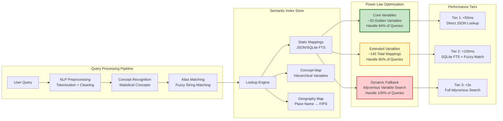
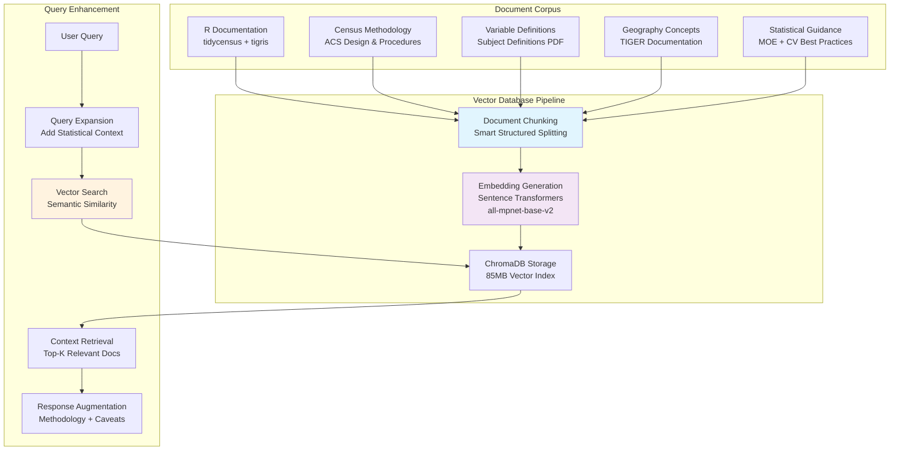
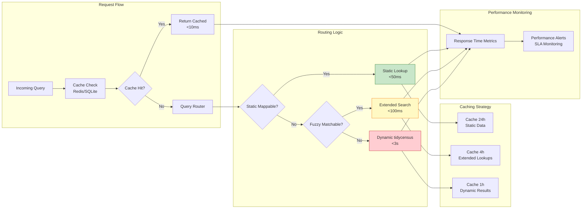

# Phase 3 System Architecture - Human Language Complexity Translation

## Core Concept: Division of Labor

**tidycensus (Kyle Walker's Domain):** Census API complexity - FIPS codes, API endpoints, MOE calculations, data formatting

**Census MCP Server (Our Domain):** Human language complexity - regional concepts, ambiguous terms, statistical reasoning

---

## Human Language Complexity Examples

### Geographic Complexity Translation
- **"the northeast"** → 6 specific states: CT, ME, MA, NH, RI, VT
- **"rural areas"** → urban-rural classification codes + geographic filtering
- **"major cities"** → population threshold + geography hierarchy decision
- **"Austin"** → Austin, TX (not Austin, MN or 20 other Austins)

### Variable Complexity Translation  
- **"teacher salaries"** → BLS not Census + methodology explanation + where to look
- **"income"** → median not mean + proper universe + statistical caveats
- **"poverty"** → which poverty measure + threshold definition + exclusions

### Statistical Complexity Translation
- **"average"** → median for skewed distributions, mean for normal distributions
- **"compare"** → proper geographic resolution + sample size adequacy  
- **"rate"** → proper denominator + universe definition + reliability checks

---

```mermaid
graph TB
    subgraph "User Layer"
        U[User Query: "How much do teachers make in Austin?"]
        CD[Claude Desktop]
        U --> CD
    end
    
    subgraph "MCP Protocol Layer"
        CD --> MCP[MCP Server Entry Point]
    end
    
    subgraph "Intelligence Layer - Phase 3 Enhanced"
        MCP --> QP[Query Parser & Router]
        QP --> SI[Semantic Index<br/>⚡ <100ms Core Queries]
        QP --> KB[Knowledge Base<br/>📚 RAG Vector Search]
        
        SI --> SM[Static Mappings<br/>🎯 Power Law Variables]
        SI --> FC[Fuzzy Concept Matcher<br/>🔍 Alias Expansion]
        
        KB --> VDB[Vector Database<br/>ChromaDB + Sentence Transformers]
        KB --> DOC[R Documentation Corpus<br/>Census Methodology]
    end
    
    subgraph "Data Retrieval Layer"
        SM --> RE[R Engine<br/>tidycensus Integration]
        FC --> RE
        KB --> RE
        
        RE --> GP[Geography Parser<br/>Location → FIPS Codes]
        RE --> VM[Variable Mapper<br/>Concepts → Census Variables]
        RE --> TC[tidycensus Core<br/>R Subprocess]
    end
    
    subgraph "External APIs"
        TC --> CAPI[Census Bureau APIs<br/>ACS/Decennial Data]
        TC --> TIGER[TIGER Geographic Data<br/>Shapefiles & Boundaries]
    end
    
    subgraph "Response Layer"
        RE --> SP[Statistical Processor<br/>MOE Calculations & Validation]
        SP --> RF[Response Formatter<br/>Context + Methodology Notes]
        RF --> MCP
    end
    
    style SI fill:#e1f5fe,stroke:#01579b,stroke-width:3px
    style SM fill:#f3e5f5,stroke:#4a148c,stroke-width:2px
    style FC fill:#fff3e0,stroke:#e65100,stroke-width:2px
    style RE fill:#e8f5e8,stroke:#1b5e20,stroke-width:2px
```

## Semantic Index Architecture (Phase 3 Core Innovation)



## Knowledge Base & RAG Architecture



## Phase 3 Performance Architecture



## Phase 3 Design Specifications

### Semantic Index Structure
```json
{
  "core_variables": {
    "population": {
      "variable": "B01003_001",
      "aliases": ["pop", "people", "residents", "total_population"],
      "statistical_note": "Universe: Total population",
      "response_time_target": "30ms"
    },
    "median_income": {
      "variable": "B19013_001", 
      "aliases": ["income", "household_income", "earnings", "salary"],
      "statistical_note": "Inflation-adjusted, excludes group quarters",
      "response_time_target": "30ms"
    }
  },
  "extended_variables": { /* 125 additional mappings */ },
  "concept_hierarchies": {
    "income": ["median_income", "per_capita_income", "family_income"],
    "employment": ["unemployment_rate", "labor_force", "employment_ratio"]
  }
}
```

### Performance Targets
- **Tier 1 (Core):** <50ms for 20 golden variables (64% of queries)
- **Tier 2 (Extended):** <100ms for 145 total variables (80% of queries)  
- **Tier 3 (Dynamic):** <3s for comprehensive tidycensus search (100% coverage)
- **Cache Hit Rate:** >70% for repeated location/variable combinations
- **Uptime SLA:** 99.5% availability

### Geographic Disambiguation Enhancement
```mermaid
graph TD
    LOC[Location Input: "Springfield"] --> AMB{Ambiguous?}
    AMB -->|Yes| DIS[Disambiguation Logic]
    AMB -->|No| DIRECT[Direct FIPS Lookup]
    
    DIS --> MAJOR[Check Major Cities<br/>Population Ranking]
    DIS --> STATE[State Context Clues<br/>"Springfield, IL"]
    DIS --> USER[User Clarification<br/>Present Options]
    
    MAJOR --> RANK[Population-Weighted<br/>Preference]
    STATE --> FIPS[FIPS Code Resolution]
    USER --> SELECT[User Selection]
    
    RANK --> FIPS
    SELECT --> FIPS
    DIRECT --> FIPS
    FIPS --> VALID[Validate Geographic<br/>Hierarchy]
```

### Implementation Priority
1. **Core Variable Static Index** (Week 1)
2. **Fuzzy Matching Engine** (Week 2)  
3. **Caching Layer** (Week 3)
4. **Performance Monitoring** (Week 4)
5. **Geographic Disambiguation** (Week 5-6)

This architecture maintains the current functionality while adding the performance optimizations needed for production-scale deployment.