# Phase 3 System Architecture - Human Language Complexity Translation

## Core Concept: Division of Labor

**tidycensus (Kyle Walker's Domain):** Census API complexity - FIPS codes, API endpoints, MOE calculations, data formatting

**Census MCP Server (Our Domain):** Human language complexity - regional concepts, ambiguous terms, statistical reasoning

---

## Human Language Complexity Examples

### Geographic Complexity Translation
- **"the northeast"** → 6 specific states: CT, ME, MA, NH, RI, VT
- **"rural areas"** → urban-rural classification codes + geographic filtering
- **"major cities"** → population threshold + geography hierarchy decision
- **"Austin"** → Austin, TX (not Austin, MN or 20 other Austins)

### Variable Complexity Translation  
- **"teacher salaries"** → BLS not Census + methodology explanation + where to look
- **"income"** → median not mean + proper universe + statistical caveats
- **"poverty"** → which poverty measure + threshold definition + exclusions

### Statistical Complexity Translation
- **"average"** → median for skewed distributions, mean for normal distributions
- **"compare"** → proper geographic resolution + sample size adequacy  
- **"rate"** → proper denominator + universe definition + reliability checks

---

```mermaid
graph TB
    subgraph "User Layer"
        U[User Query: "How much do teachers make in Austin?"]
        CD[Claude Desktop]
        U --> CD
    end
    
    subgraph "MCP Protocol Layer"
        CD --> MCP[MCP Server Entry Point]
    end
    
    subgraph "Intelligence Layer - Phase 3 Enhanced"
        MCP --> QP[Query Parser & Router]
        QP --> SI[Semantic Index<br/>⚡ <100ms Core Queries]
        QP --> KB[Knowledge Base<br/>📚 RAG Vector Search]
        
        SI --> SM[Static Mappings<br/>🎯 Power Law Variables]
        SI --> FC[Fuzzy Concept Matcher<br/>🔍 Alias Expansion]
        
        KB --> VDB[Vector Database<br/>ChromaDB + Sentence Transformers]
        KB --> DOC[R Documentation Corpus<br/>Census Methodology]
    end
    
    subgraph "Data Retrieval Layer"
        SM --> RE[R Engine<br/>tidycensus Integration]
        FC --> RE
        KB --> RE
        
        RE --> GP[Geography Parser<br/>Location → FIPS Codes]
        RE --> VM[Variable Mapper<br/>Concepts → Census Variables]
        RE --> TC[tidycensus Core<br/>R Subprocess]
    end
    
    subgraph "External APIs"
        TC --> CAPI[Census Bureau APIs<br/>ACS/Decennial Data]
        TC --> TIGER[TIGER Geographic Data<br/>Shapefiles & Boundaries]
    end
    
    subgraph "Response Layer"
        RE --> SP[Statistical Processor<br/>MOE Calculations & Validation]
        SP --> RF[Response Formatter<br/>Context + Methodology Notes]
        RF --> MCP
    end
    
    style SI fill:#e1f5fe,stroke:#01579b,stroke-width:3px
    style SM fill:#f3e5f5,stroke:#4a148c,stroke-width:2px
    style FC fill:#fff3e0,stroke:#e65100,stroke-width:2px
    style RE fill:#e8f5e8,stroke:#1b5e20,stroke-width:2px
```

## Geographic Intelligence Translation Architecture

```mermaid
graph LR
    subgraph "Human Geographic Concepts"
        HG1["the northeast"]
        HG2["rural counties"] 
        HG3["Harris County"]
        HG4["major cities"]
        HG5["which state has highest..."]
    end
    
    subgraph "Geography Translator Engine"
        HG1 --> GT1[Regional Mapper<br/>Northeast → CT,ME,MA,NH,RI,VT]
        HG2 --> GT2[Classification Mapper<br/>Rural → NCHS urban-rural codes]
        HG3 --> GT3[Disambiguation Engine<br/>Harris County → Harris County, Texas]
        HG4 --> GT4[Hierarchy Selector<br/>Major cities → population threshold + geography level]
        HG5 --> GT5[Comparison Router<br/>National comparison → all states analysis]
    end
    
    subgraph "tidycensus-Compatible Output"
        GT1 --> TC1[geography='state'<br/>state=c('CT','ME','MA','NH','RI','VT')]
        GT2 --> TC2[geography='county'<br/>+ rural filter logic]
        GT3 --> TC3[geography='county'<br/>state='TX', county='Harris']
        GT4 --> TC4[geography='place'<br/>+ population threshold filter]
        GT5 --> TC5[geography='state'<br/>state=NULL (all states)]
    end
    
    style GT1 fill:#e1f5fe,stroke:#01579b,stroke-width:2px
    style GT2 fill:#f3e5f5,stroke:#4a148c,stroke-width:2px
    style GT3 fill:#fff3e0,stroke:#e65100,stroke-width:2px
    style GT4 fill:#e8f5e8,stroke:#1b5e20,stroke-width:2px
    style GT5 fill:#fce4ec,stroke:#880e4f,stroke-width:2px
```

## The 4 Essential Capabilities (Not Individual Tools)

### 1. Demography - Variable Intelligence Translation

```mermaid
graph LR
    D1["teacher salary"] --> DT1[Domain Router<br/>→ BLS not Census]
    D2["median income"] --> DT2[Variable Mapper<br/>→ B19013_001 + why median]
    D3["poverty rate"] --> DT3[Concept Definer<br/>→ B17001_002 + universe]
    D4["average income"] --> DT4[Statistical Advisor<br/>→ Use median for income]
    
    style DT1 fill:#e1f5fe
    style DT2 fill:#f3e5f5  
    style DT3 fill:#fff3e0
    style DT4 fill:#e8f5e8
```


### 2. Geography - Spatial Intelligence Translation

```mermaid
graph LR
    G1["the northeast"] --> GT1[Regional Resolver<br/>→ Multi-state analysis]
    G2["rural counties"] --> GT2[Classification Filter<br/>→ Geographic filtering]
    G3["Harris County"] --> GT3[Disambiguator<br/>→ Harris County, Texas]
    G4["which state highest"] --> GT4[Comparison Router<br/>→ National analysis]
    
    style GT1 fill:#e1f5fe
    style GT2 fill:#f3e5f5
    style GT3 fill:#fff3e0
    style GT4 fill:#e8f5e8
```


### 3. Statistics - Methodological Intelligence


### 4. Statistical Reasoning - Domain Intelligence


## Data Platform Architecture - Knowledge Base & Ontology Integration


## Configuration-Driven Data Platform

### Knowledge Base Configuration Structure
```yaml
# knowledge-base/scripts/config.yaml
surveys:
  census:
    - name: "acs5"
      years: [2018, 2019, 2020, 2021, 2022]
      description: "5-year American Community Survey"
      variables_endpoint: "{year}/acs/acs5/variables.json"
    - name: "acs1" 
      years: [2019, 2021, 2022]
      description: "1-year American Community Survey"
      variables_endpoint: "{year}/acs/acs1/variables.json"
    - name: "dec"
      years: [2020]
      description: "Decennial Census"
      variables_endpoint: "{year}/dec/variables.json"
  
  future_expansion:
    - name: "sipp"
      source: "census"
      description: "Survey of Income and Program Participation"
    - name: "cps" 
      source: "bls"
      description: "Current Population Survey"

agencies:
  census:
    base_url: "https://api.census.gov/data"
    ontology_priority: "primary"
  bls:
    soc_codes_url: "https://www.bls.gov/soc/"
    ontology_priority: "occupation_routing"

geographic_levels:
  - "us"
  - "state"
  - "county" 
  - "place"
  - "tract"
  - "block_group"
```

### Build Pipeline Architecture

