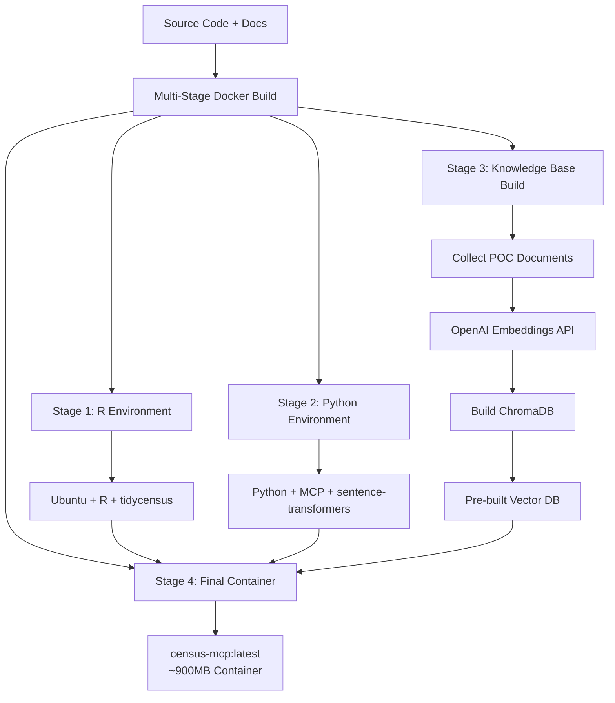
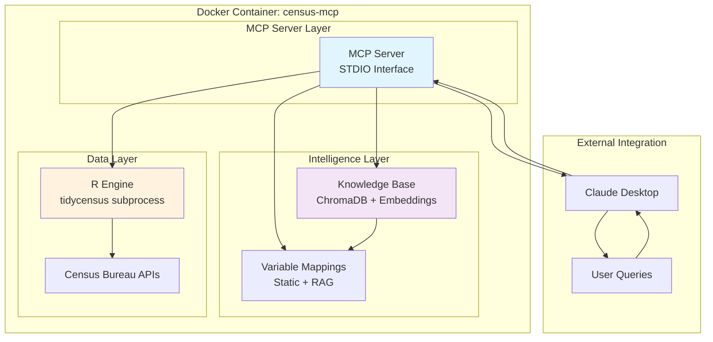
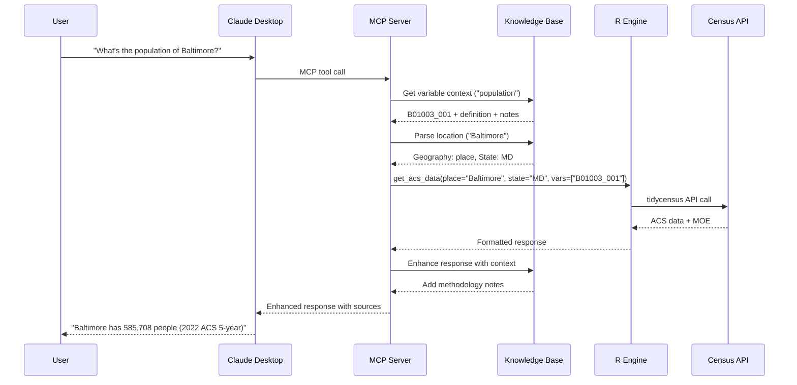
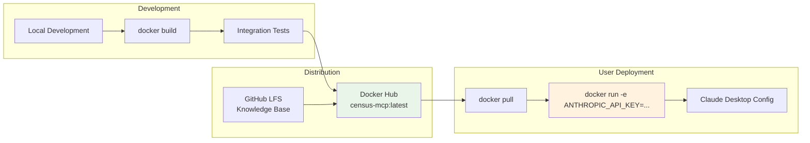

# Sprint 2 Container Architecture

## Container Build Process

## Runtime Container Architecture

## Query Processing Flow

## Container Deployment Model

## Key Architecture Decisions

### Build-Time vs Runtime
- **Knowledge Base**: Built during container build (OpenAI embeddings)
- **R Environment**: Pre-installed during build
- **MCP Server**: Starts immediately at runtime

### Data Flow
1. **User Query** → Claude Desktop → MCP Server
2. **Variable Mapping** → Knowledge Base (RAG or static)
3. **Data Retrieval** → R subprocess → Census API
4. **Response Enhancement** → Knowledge Base context
5. **Formatted Response** → Claude Desktop → User

### Container Size Budget
- Base Ubuntu + R + Python: ~400MB
- Knowledge Base (vector DB): ~300MB  
- Sentence transformer model: ~90MB
- Application code: ~50MB
- **Total: ~840MB**